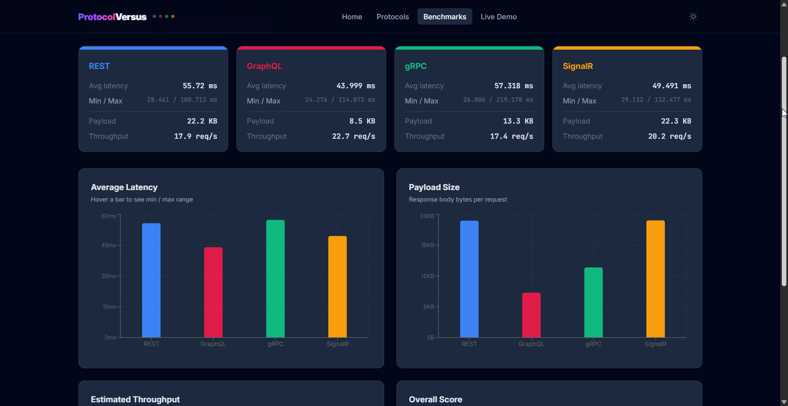

<div align="center">


# Communication Pattern Versus

**Compare REST, gRPC, GraphQL, and SignalR side-by-side — with live benchmarks and interactive demos.**

Built with .NET 10 and React 19


</div>

## Overview

Communication Pattern Versus is a full-stack educational application that lets you explore and compare four major API communication protocols through interactive demos and real-time benchmarks. Instead of reading about the theoretical differences, you can see them in action — latency, throughput, and developer experience — all on a single dashboard.

## Features

- **Protocol Deep-Dives** — Detailed pages for REST, gRPC, GraphQL, and SignalR covering philosophy, how it works, code examples, security notes, and real-world adoption
- **Live Benchmarks** — Run real API calls and see response time comparisons rendered as interactive charts
- **Interactive Live Demo** — Hands-on playground to query products, place orders, and observe real-time updates via each protocol
- **Side-by-Side Comparison** — Visual radar and bar charts comparing latency, throughput, payload size, and more
- **100K Product Catalog** — Seeded in-memory database for realistic benchmark scenarios
- **Docker Ready** — One command to spin up both API and frontend

## Pages

### Home

Overview of the four protocols with quick navigation.

<div align="center">
  
</div>

### Protocol Details

Deep-dive into each protocol: philosophy, how it works, code examples, real-world adoption, and security notes.

<div align="center">
  
</div>

### Benchmark Comparison

Run benchmarks and view interactive charts comparing response times across all four protocols.

<div align="center">
  
</div>

### Live Demo

Interactive playground to test each protocol with real API calls and real-time SignalR events.

<div align="center">
  
</div>

## Tech Stack

| Layer | Technology |
|-------|-----------|
| **Backend** | .NET 10, ASP.NET Core Minimal APIs, EF Core (InMemory) |
| **REST** | ASP.NET Core Minimal APIs |
| **gRPC** | Grpc.AspNetCore with grpc-web proxy |
| **GraphQL** | HotChocolate 15 |
| **Real-time** | ASP.NET Core SignalR |
| **Frontend** | React 19, TypeScript 6, Vite 8 |
| **Styling** | Tailwind CSS v4 (`@tailwindcss/vite` plugin) |
| **Charts** | Recharts |
| **Containers** | Docker multi-stage builds, docker-compose |

## Architecture

The backend follows **Clean Architecture** with four layers:

```
src/
├── Domain/            # Entities, Value Objects, Repository interfaces
├── Application/       # Services, DTOs, Mappers
├── Infrastructure/    # EF Core, Repositories, Database seeding
└── Api/               # REST endpoints, gRPC service, GraphQL schema, SignalR hub
```

The frontend is a single-page React app with page-based routing:

```
frontend/src/
├── pages/             # HomePage, ProtocolPage, ComparePage, LiveDemoPage
├── grpc/              # gRPC-web client (protobufjs)
├── api.ts             # API client (REST, GraphQL, gRPC, SignalR)
├── protocolData.ts    # Protocol descriptions and colors
└── types.ts           # TypeScript interfaces
```

## Getting Started

### Prerequisites

- [.NET 10 SDK](https://dotnet.microsoft.com/download)
- [Node.js 22+](https://nodejs.org/)
- Or just [Docker](https://www.docker.com/) to run everything containerized

### Run Locally

**1. Start the API:**

```bash
cd src/Api
dotnet run
```

The API starts on `http://localhost:5000` with 100K seeded products.

**2. Start the frontend:**

```bash
cd frontend
npm install
npm run dev
```

The frontend starts on `http://localhost:5173` (port may vary).

### Run with Docker

```bash
docker-compose up --build
```

| Service | URL |
|---------|-----|
| API | http://localhost:5000 |
| Frontend | http://localhost:3000 |

> [!TIP]
> The frontend container waits for the API health check to pass before starting.

## Running Tests

```bash
dotnet test
```

Runs 28 unit tests covering domain entities, value objects, and application services.

## Project Structure

```
CommunicationPatternVersus/
├── src/
│   ├── Domain/                 # Entities, Value Objects, Interfaces
│   ├── Application/            # Services, DTOs, Mappers
│   ├── Infrastructure/         # EF Core, Repositories, Seeding
│   └── Api/                    # Endpoints, gRPC, GraphQL, SignalR, Protos
├── tests/
│   └── Tests/                  # xUnit tests (Domain + Application)
├── frontend/                   # React 19 + Vite + Tailwind v4
├── Dockerfile.api              # .NET multi-stage build
├── Dockerfile.frontend         # Node + nginx multi-stage build
├── docker-compose.yml          # Orchestration
└── CommunicationPatternVersus.slnx
```

## API Endpoints

| Protocol | Endpoint | Description |
|----------|----------|-------------|
| REST | `GET /api/products` | Paginated product list |
| REST | `POST /api/orders` | Create an order |
| gRPC | `CatalogService/GetProducts` | Streaming product fetch |
| GraphQL | `POST /graphql` | Flexible queries and mutations |
| SignalR | `/hubs/catalog` | Real-time order notifications |
| Benchmark | `GET /api/benchmark/{protocol}` | Run benchmark for a protocol |
| Health | `GET /health` | API health check |
